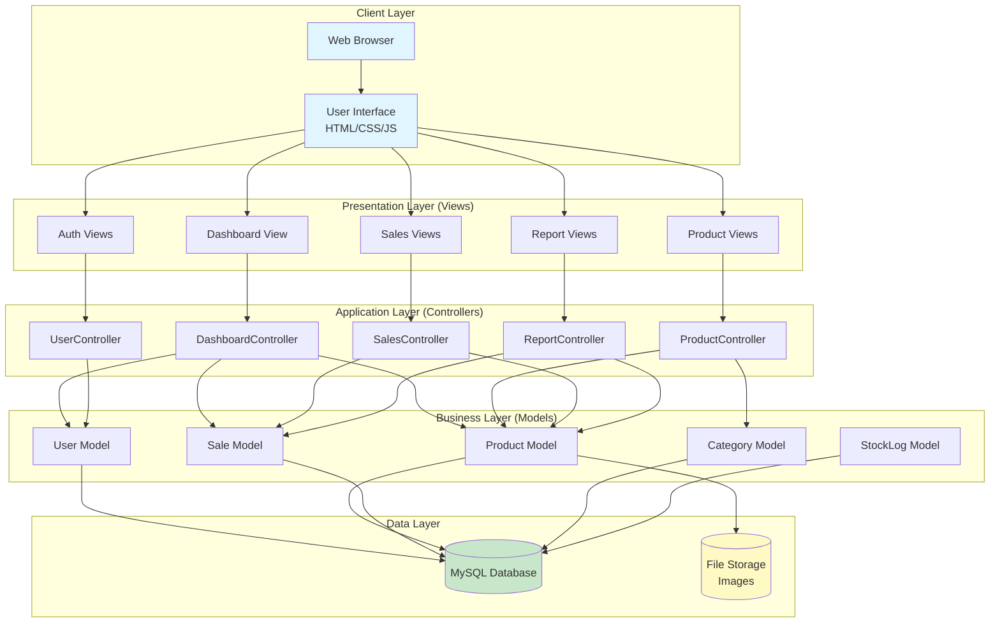

<div align="center">
  
# 📦stock: Smart Inventory & Sales Management System

[](https://php.net)
[](https://mysql.com)
[](https://tailwindcss.com)
[](LICENSE)
[](https://github.com)
[](https://github.com)

</div>

---

## 📌 Overview

**stock-inventory-system** is a comprehensive web-based inventory and sales management system developed for small to medium-sized retail businesses. The system enables real-time tracking of stock levels, sales transactions, and generates insightful reports.

Built with **PHP** (Server-side scripting), **MySQL** (Database), and following **MVC architecture**, TKC-Stock provides an intuitive interface for managing products, processing sales, and monitoring business performance.

---

## 🎯 Problem Statement

Small retail businesses face significant challenges:

| Challenge | Impact |
|-----------|--------|
| ❌ Manual inventory tracking | Stockouts or overstocking |
| ❌ No real-time sales data | Poor forecasting |
| ❌ Disconnected systems | Duplicate data entry |
| ❌ Lack of reporting | No data-driven decisions |
| ❌ Inventory shrinkage | Undetected losses |

**Solution:stock-inventory-system addresses ALL these challenges!**

---

## ✨ Features

### 🔐 Authentication & User Management
- Secure login with password hashing (bcrypt)
- Role-based access control (Admin, Manager, Cashier)
- Session management for security
- User registration and profile management

### 📦 Product Management (CRUD)
- Add, edit, delete, and view products
- Product categorization
- Stock quantity tracking
- Product images upload
- Search and filter products
- Low stock alerts

### 🛒 Sales Processing (POS)
- Shopping cart functionality
- Process sales with multiple items
- Automatic invoice generation
- Multiple payment methods (Cash, Card, Mobile)
- Discount and tax calculation
- Sales history viewing

### 📊 Reporting & Analytics
- Dashboard with key metrics
- Daily sales report
- Monthly revenue report
- Top selling products
- Stock valuation report
- Low stock alerts

### 📁 File Management
- Product image upload (JPG, PNG, GIF, WEBP)
- Image validation and optimization
- Secure file storage

---

## 🏗️ System Architecture (MVC)



### Architecture Flow Explanation

```
User → Browser → View → Controller → Model → Database → Back to User
```

| Layer | Component | Responsibility |
|-------|-----------|----------------|
| **Layer 1** | Client Layer | Browser, User Interface (HTML/CSS/JS) |
| **Layer 2** | Presentation Layer | Views (login, dashboard, products, sales) |
| **Layer 3** | Application Layer | Controllers (handle requests, validation) |
| **Layer 4** | Business Layer | Models (data logic, database operations) |
| **Layer 5** | Data Layer | MySQL Database, File Storage |

---

## 📊 Database Schema (ERD)

### Tables Structure

| Table | Description | Key Fields |
|-------|-------------|------------|
| `users` | User authentication & roles | id (PK), email, username, role |
| `categories` | Product categories | id (PK), name |
| `products` | Main product inventory | id (PK), name, price, quantity, category_id (FK) |
| `sales` | Transaction headers | id (PK), invoice_no, user_id (FK), total_amount |
| `sale_items` | Line items per sale | id (PK), sale_id (FK), product_id (FK) |
| `stock_logs` | Stock change audit trail | id (PK), product_id (FK), user_id (FK) |

### Relationships

```
┌─────────────┐     ┌─────────────┐     ┌─────────────┐
│   users     │     │  products   │     │ categories  │
├─────────────┤     ├─────────────┤     ├─────────────┤
│ id (PK)     │◄──┐ │ id (PK)     │────►│ id (PK)     │
│ name        │    │ │ name        │     │ name        │
│ email       │    │ │ price       │     └─────────────┘
│ role        │    │ │ quantity    │
└─────────────┘    │ │ category_id │
         │         │ └─────────────┘
         │         │         ▲
         ▼         │         │
┌─────────────┐    │ ┌─────────────┐
│   sales     │    │ │ sale_items  │
├─────────────┤    │ ├─────────────┤
│ id (PK)     │    └─│ id (PK)     │
│ user_id (FK)│──────│ sale_id (FK)│
│ total       │      │ product_id  │
└─────────────┘      │ quantity    │
                     └─────────────┘
```

---

## 🛠️ Technology Stack

| Layer | Technology | Version |
|-------|------------|---------|
| **Frontend** | HTML5, CSS3 (Tailwind CSS), JavaScript | - |
| **Backend** | PHP (OOP) | 8.x |
| **Database** | MySQL | 8.0 |
| **Server** | Apache (XAMPP/WAMP) | - |
| **Authentication** | PHP Sessions | - |
| **Security** | Prepared statements, password_hash() | - |
| **Icons** | Font Awesome | 6.x |
| **Charts** | Chart.js (optional) | - |

---

## 📁 Project Structure

```
tkc-stock/
│
├── index.php                    # Entry point (Router)
│
├── config/
│   ├── database.php             # Database connection
│   └── config.php               # Application configuration
│
├── controllers/                 # Controllers (Application Logic)
│   ├── UserController.php
│   ├── ProductController.php
│   ├── SalesController.php
│   ├── ReportController.php
│   └── DashboardController.php
│
├── models/                      # Models (Database Operations)
│   ├── User.php
│   ├── Product.php
│   ├── Sale.php
│   ├── Category.php
│   └── StockLog.php
│
├── views/                       # Views (Templates)
│   ├── layouts/
│   │   ├── header.php
│   │   ├── sidebar.php
│   │   └── footer.php
│   ├── auth/
│   │   ├── login.php
│   │   └── register.php
│   ├── dashboard/
│   │   └── index.php
│   ├── products/
│   │   ├── index.php
│   │   ├── create.php
│   │   └── edit.php
│   ├── sales/
│   │   ├── index.php
│   │   ├── create.php
│   │   └── invoice.php
│   └── reports/
│       └── index.php
│
├── public/                      # Public Assets
│   ├── css/
│   │   └── style.css
│   ├── js/
│   │   └── main.js
│   └── uploads/
│       └── products/
│
├── includes/
│   └── functions.php
│
├── database.sql                 # Database schema
└── README.md                    # Documentation
```

---

## 🚀 Installation Guide

### Prerequisites

- XAMPP / WAMP / MAMP installed
- PHP 8.x or higher
- MySQL 8.0 or higher
- Git (optional)

### Step-by-Step Installation

#### 1. Clone the Repository

```bash
git clone https://github.com/TsegayIS122123/stock-inventory-system.git
cd stock-inventory-system
```

#### 2. Move to XAMPP Directory

```bash
# For Windows
copy stock-inventory-system C:\xampp\htdocs\tkc-stock

# For Mac
cp -r stock-inventory-system /Applications/XAMPP/htdocs/tkc-stock

# For Linux
sudo cp -r stock-inventory-system /opt/lampp/htdocs/tkc-stock
```

#### 3. Start XAMPP Services

- Open XAMPP Control Panel
- Start **Apache** (Port 80)
- Start **MySQL** (Port 3306)

#### 4. Import Database

**Option A: Using phpMyAdmin**
1. Open browser → `http://localhost/phpmyadmin`
2. Create database: `tkc_stock`
3. Click **Import** tab
4. Select `database.sql` file
5. Click **Go**

**Option B: Using MySQL Command Line**
```bash
mysql -u root -p
CREATE DATABASE tkc_stock;
USE tkc_stock;
SOURCE database.sql;
EXIT;
```

#### 5. Configure Database Connection

Edit `config/database.php`:

```php
private $host = 'localhost';
private $dbname = 'tkc_stock';
private $username = 'root';
private $password = '';  // Empty for XAMPP default
```

#### 6. Run the Application

Open browser and navigate to:
```
http://localhost/tkc-stock/
```

---

## 🔑 Login Credentials

### Demo Accounts

| Role | Email | Password | Access Level |
|------|-------|----------|--------------|
| 👑 **Admin** | `admin@tkcstock.com` | `password123` | Full system access |
| 📋 **Manager** | `manager@tkcstock.com` | `password123` | Product & report management |
| 🛒 **Cashier** | `cashier@tkcstock.com` | `password123` | Sales processing only |

> **Note:** After first login, you can change your password from the profile settings.

---

## 📖 Usage Guide

### For Admin
1. Login with admin credentials
2. Manage users (add/edit/delete)
3. View all reports and analytics
4. Full CRUD operations on products
5. System configuration

### For Manager
1. Add and edit products
2. Check inventory levels
3. View sales reports
4. Manage categories

### For Cashier
1. Process sales through POS
2. Search products
3. Add items to cart
4. Generate invoices

### Common Workflows

**Add a Product:**
1. Login as Admin/Manager
2. Click "Products" → "Add Product"
3. Fill product details (name, price, quantity)
4. Upload product image (optional)
5. Click "Save"

**Process a Sale:**
1. Login as Cashier
2. Click "POS" or "New Sale"
3. Search/Select products
4. Add to cart
5. Enter customer name (optional)
6. Click "Complete Sale"
7. Print/Download invoice

---

## 🔒 Security Features

| Security Measure | Implementation |
|-----------------|----------------|
| **SQL Injection** | Prepared statements with bind_param() |
| **Password Security** | password_hash() with bcrypt |
| **Session Security** | Session ID regeneration, HTTP-only cookies |
| **XSS Protection** | htmlspecialchars() on all output |
| **CSRF Protection** | Token-based validation |
| **File Upload** | Type validation, size limits, rename files |
| **Input Validation** | Both client and server-side |

---

## 🧪 Testing

### Test Credentials Quick Access

```bash
Admin:    admin@tkcstock.com / password123
Manager:  manager@tkcstock.com / password123
Cashier:  cashier@tkcstock.com / password123
```

### Test Scenarios

1. **Login Test**: Try all three roles
2. **Product CRUD**: Add, edit, delete product
3. **Sales Process**: Create a sale with multiple items
4. **Stock Update**: Verify stock decreases after sale
5. **Low Stock Alert**: Set a product quantity below threshold

---

## 📈 Future Enhancements

- [ ] Barcode scanning integration
- [ ] Email notifications for low stock
- [ ] REST API for mobile app
- [ ] Advanced analytics dashboard with charts
- [ ] PDF invoice download
- [ ] Multiple currency support
- [ ] Supplier management
- [ ] Purchase order system
- [ ] Customer loyalty program
- [ ] Export reports to Excel/PDF

---

## 🐛 Known Issues & Solutions

| Issue | Solution |
|-------|----------|
| Database connection fails | Check MySQL is running in XAMPP |
| 404 error | Ensure .htaccess is enabled |
| Session not working | Check session_start() in config.php |
| Image upload fails | Check folder permissions (755) |

---

## 🤝 Contributing

Contributions are welcome! Please follow these steps:

1. Fork the repository
2. Create a feature branch (`git checkout -b feature/AmazingFeature`)
3. Commit changes (`git commit -m 'Add AmazingFeature'`)
4. Push to branch (`git push origin feature/AmazingFeature`)
5. Open a Pull Request

---

## 📄 License

This project is licensed under the MIT License - see the [LICENSE](LICENSE) file for details.

---

## 🙏 Acknowledgments

- PHP Documentation
- MySQL Documentation
- Tailwind CSS Team
- Font Awesome Icons

---

**Project Link:** [https://github.com/TsegayIS122123/stock-inventory-system.git](https://github.com/TsegayIS122123/stock-inventory-system)

---

<div align="center">
  
### ⭐ If you found this project helpful, please give it a star! ⭐

</div>
```

